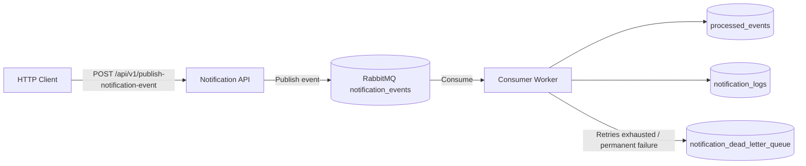
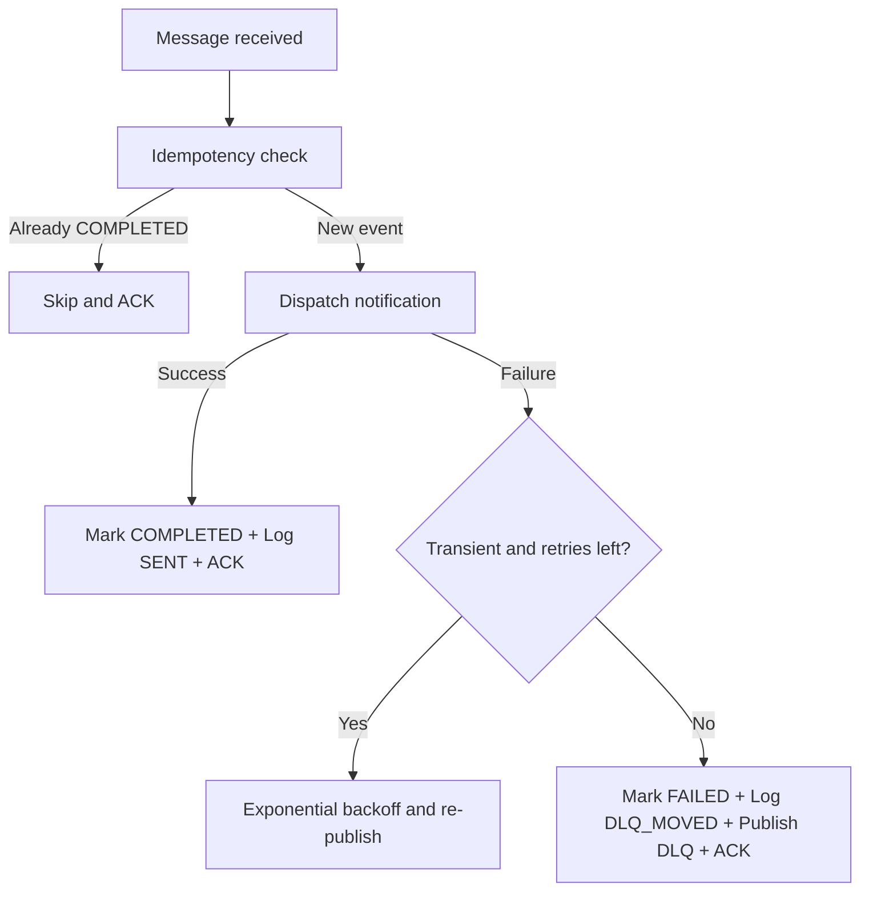

# 🔔 ReliableRelay — Event-Driven Notification Service

<div align="center">


**A production-ready, fault-tolerant notification service leveraging event-driven architecture with RabbitMQ, PostgreSQL, idempotency guarantees, exponential backoff retries, and dead-letter queue handling.**

</div>

---

## 📑 Table of Contents

- [Overview](#-overview)
- [Technologies Used](#-technologies-used)
- [Architecture](#-architecture)
- [Setup Instructions](#-setup-instructions)
- [API Documentation](#-api-documentation)
- [Idempotency Mechanism](#-idempotency-mechanism)
- [Retry Strategy](#-retry-strategy)
- [Dead-Letter Queue (DLQ)](#-dead-letter-queue-dlq)
- [How to Run Tests](#-how-to-run-tests)
- [Project Structure](#-project-structure)
- [Environment Variables](#-environment-variables)
- [Troubleshooting](#-troubleshooting)
- [Future Enhancements](#-future-enhancements)

---

## 🌐 Overview

ReliableRelay is a robust backend notification service designed for high-traffic, distributed systems. It implements a **producer-consumer pattern** using RabbitMQ as the message broker, ensuring reliable and scalable asynchronous message processing.

### Key Features

| Feature | Description |
|---------|-------------|
| **Event-Driven Architecture** | Decoupled producer-consumer pattern via RabbitMQ |
| **Idempotency** | Guarantees exactly-once processing using atomic DB operations |
| **Exponential Backoff** | Retries transient failures with increasing delays (1s → 5s → 25s) |
| **Dead-Letter Queue** | Captures permanently failed messages for manual inspection |
| **Structured Logging** | JSON-formatted logs with Winston for full observability |
| **Graceful Shutdown** | Drains in-flight messages before stopping |
| **Health Checks** | Liveness probes for all services via Docker health checks |
| **Input Validation** | Zod schema validation on all incoming events |

---

## 🛠 Technologies Used

| Technology | Purpose |
|-----------|---------|
| **Node.js 20** | JavaScript runtime |
| **TypeScript 5.8** | Type-safe development |
| **Express 4** | HTTP API framework |
| **RabbitMQ 3** | Message broker (AMQP) |
| **PostgreSQL 15** | Relational database for event tracking and logging |
| **amqplib** | RabbitMQ client for Node.js |
| **Zod** | Runtime schema validation |
| **Winston** | Structured JSON logging |
| **Docker & Docker Compose** | Containerization and orchestration |
| **Jest + ts-jest** | Unit and integration testing |
| **Supertest** | HTTP API integration testing |

---

## 🏗 Architecture

### System Architecture



### Message Processing Flow



### Error Classification

| Error Type | Behavior | Example |
|-----------|----------|---------|
| **Transient** | Retry with exponential backoff | DB timeout, network glitch, external API 503 |
| **Permanent** | Immediate DLQ movement | Malformed data, invalid configuration |

---

## 🚀 Setup Instructions

### Prerequisites

- [Docker](https://docs.docker.com/get-docker/) (v20+)
- [Docker Compose](https://docs.docker.com/compose/install/) (v2+)

### Quick Start

```bash
# 1. Clone the repository
git clone <repository-url>
cd reliablerelay

# 2. Create environment file
cp .env.example .env

# 3. Build and start all services
docker-compose up --build

# 4. Verify all services are healthy
docker-compose ps
```

The service will be available at:
- **Notification Service**: http://localhost:3000
- **RabbitMQ Management UI**: http://localhost:15672 (guest/guest)
- **PostgreSQL**: localhost:5432

### Deploy on Render (Live Backend)

This repository includes a Render Blueprint file: `render.yaml`.

1. Push your latest code to GitHub.
2. In Render, click **New +** → **Blueprint**.
3. Connect the `NotifyNexus` repository.
4. Render will detect `render.yaml` and create:
  - `notifynexus-api` (web service)
  - `notifynexus-rabbitmq` (private RabbitMQ service)
  - `notifynexus-db` (PostgreSQL database)
5. Click **Apply** to provision all resources.
6. Wait for all services to become healthy, then open:
  - `https://<your-render-web-url>/api/health`

Notes:
- The app now initializes DB schema automatically on startup, so no manual SQL migration step is required for Render.
- On free/starter plans, first request after idle may be slower due to cold start behavior.
- If deploy logs show `Failed to start server` with `AggregateError`, verify that your web service has valid `DB_*` and `MQ_*` environment variables set. On Render, this usually means the Blueprint was not applied or dependencies were not attached.

### Verify Health

```bash
curl http://localhost:3000/api/health
```

Expected response:
```json
{
  "status": "ok",
  "timestamp": "2026-03-19T10:30:00.000Z",
  "services": {
    "database": "connected",
    "messageQueue": "connected"
  }
}
```

---

## 📡 API Documentation

### POST `/api/v1/publish-notification-event`

Publishes a notification event to the RabbitMQ message queue for asynchronous processing.

#### Request

**Headers:**
```
Content-Type: application/json
```

**Body (`NotificationEvent` schema):**

| Field | Type | Required | Description |
|-------|------|----------|-------------|
| `event_id` | string (UUID) | ✅ | Unique identifier for idempotency |
| `type` | enum | ✅ | One of: `email`, `sms`, `push` |
| `recipient` | string | ✅ | Email address, phone number, or device token |
| `payload` | object | ✅ | Dynamic notification content |
| `timestamp` | string (ISO 8601) | ✅ | Event creation timestamp |

#### Example Request

```bash
curl -X POST http://localhost:3000/api/v1/publish-notification-event \
  -H "Content-Type: application/json" \
  -d '{
    "event_id": "550e8400-e29b-41d4-a716-446655440000",
    "type": "email",
    "recipient": "user@example.com",
    "payload": {
      "subject": "Welcome to Our Platform!",
      "body": "Hello! Your account has been successfully created."
    },
    "timestamp": "2026-03-19T10:30:00Z"
  }'
```

#### Responses

| Status | Description | Body |
|--------|------------|------|
| `202 Accepted` | Event successfully published to MQ | `{"message": "Event successfully published to MQ", "eventId": "..."}` |
| `400 Bad Request` | Invalid payload (validation error) | `{"error": "Invalid NotificationEvent payload", "details": [...]}` |
| `500 Internal Server Error` | MQ connection or publishing failure | `{"error": "Internal Server Error"}` |

#### Testing Flags

For controlled testing, include these flags in the `payload`:

| Flag | Effect |
|------|--------|
| `"force_fail": true` | Forces a transient failure (triggers retry logic) |
| `"permanent_fail": true` | Forces a permanent failure (triggers immediate DLQ) |

```bash
# Test retry mechanism
curl -X POST http://localhost:3000/api/v1/publish-notification-event \
  -H "Content-Type: application/json" \
  -d '{
    "event_id": "550e8400-e29b-41d4-a716-446655440111",
    "type": "email",
    "recipient": "test@example.com",
    "payload": { "subject": "Retry Test", "force_fail": true },
    "timestamp": "2026-03-19T10:30:00Z"
  }'
```

### GET `/api/health`

Health check endpoint for Docker and load balancer liveness probes.

---

## 🔐 Idempotency Mechanism

Idempotency ensures that each notification event is processed **exactly once**, even if the message is delivered multiple times (which is common in distributed systems with at-least-once delivery).

### How It Works

1. **Atomic Upsert**: When a message arrives, we perform an `INSERT ... ON CONFLICT` query on the `processed_events` table. This atomically checks for duplicates and marks the event as `PROCESSING`.

2. **Status Machine**: Each event transitions through statuses:
   ```
   (new) → PROCESSING → COMPLETED
                      → FAILED
   ```

3. **Duplicate Detection**: If the event_id already exists:
   - **COMPLETED** → Skip processing, acknowledge message
   - **PROCESSING** → Another consumer is handling it, re-queue
   - **FAILED** → Allow re-processing (retry from queue)

### Database Schema

```sql
CREATE TABLE processed_events (
    event_id VARCHAR(255) PRIMARY KEY,
    status VARCHAR(50) NOT NULL,    -- 'PROCESSING', 'COMPLETED', 'FAILED'
    created_at TIMESTAMP DEFAULT CURRENT_TIMESTAMP,
    updated_at TIMESTAMP DEFAULT CURRENT_TIMESTAMP
);
```

---

## 🔄 Retry Strategy

The service implements an **exponential backoff** strategy for transient failures, preventing cascade failures and giving external services time to recover.

### Backoff Schedule

| Attempt | Delay | Formula |
|---------|-------|---------|
| 1st retry | 1,000 ms (1s) | `1000 × 5⁰` |
| 2nd retry | 5,000 ms (5s) | `1000 × 5¹` |
| 3rd retry | 25,000 ms (25s) | `1000 × 5²` |
| Max retries exhausted | → **DLQ** | — |

### Configuration

| Variable | Default | Description |
|----------|---------|-------------|
| `MAX_RETRIES` | `3` | Maximum retry attempts before DLQ |
| `RETRY_INITIAL_DELAY` | `1000` | Base delay in milliseconds |

### How It Works

1. On failure, the original message is **acknowledged** (removed from queue)
2. After the calculated delay, a **new message** is published with an incremented `x-retry-count` header
3. This avoids blocking the consumer during the backoff period
4. All retry attempts are logged with timing details

---

## 💀 Dead-Letter Queue (DLQ)

Messages that **permanently fail** or **exhaust all retry attempts** are moved to the Dead-Letter Queue for manual inspection and debugging.

### DLQ Triggers

| Trigger | Behavior |
|---------|----------|
| Max retries exceeded | After 3 failed attempts (configurable) |
| Permanent error | Immediately (e.g., invalid payload configuration) |

### DLQ Message Format

```json
{
  "originalEvent": { "event_id": "...", "type": "email", "..." : "..." },
  "error": "Transient external service failure",
  "retryCount": 3,
  "failedAt": "2026-03-19T10:35:25.000Z"
}
```

### Inspecting the DLQ

Use the RabbitMQ Management UI at http://localhost:15672:
1. Navigate to **Queues** → `notification_dead_letter_queue`
2. Click **Get messages** to inspect failed messages
3. Messages can be requeued or purged after investigation

---

## 🧪 How to Run Tests

### Run All Tests

```bash
# Using npm (locally)
npm test

# Inside Docker container
docker-compose exec notification_service npm test
```

### Run Unit Tests Only

```bash
npm run test:unit
```

### Run Integration Tests Only

```bash
npm run test:integration
```

### Test Coverage Summary

| Test Suite | Tests | Description |
|-----------|-------|-------------|
| **Unit: Idempotency** | 5 | Event status checks, DB atomicity, error propagation |
| **Unit: Notification** | 7 | Dispatch simulation, error types, DB logging |
| **Unit: Consumer** | 7 | Happy path, retry logic, DLQ movement, message parsing |
| **Unit: Validation** | 9 | Schema validation for all field types and edge cases |
| **Integration: Publisher** | 9 | API endpoint validation, error responses, MQ publishing |
| **Integration: Consumer** | 7 | End-to-end flow, idempotency, DLQ, exponential backoff |
| **Total** | **44** | |

---

## 📁 Project Structure

```
reliablerelay/
├── src/
│   ├── api/
│   │   └── index.ts            # Express router with POST endpoint
│   ├── consumer/
│   │   └── index.ts            # MQ consumer with retry & DLQ logic
│   ├── services/
│   │   ├── idempotency.ts      # Idempotency check/update functions
│   │   ├── mq.ts               # RabbitMQ connection, publish, consume
│   │   └── notification.ts     # Dispatch simulation & DB logging
│   ├── config/
│   │   └── index.ts            # Environment-based configuration
│   ├── db/
│   │   └── index.ts            # PostgreSQL connection pool
│   └── utils/
│       └── logger.ts           # Winston structured logger
├── tests/
│   ├── unit/
│   │   ├── idempotency.test.ts # Idempotency service tests
│   │   ├── notification.test.ts# Notification service tests
│   │   ├── consumer.test.ts    # Consumer logic tests
│   │   └── validation.test.ts  # Schema validation tests
│   └── integration/
│       ├── publisher.test.ts   # API endpoint integration tests
│       └── consumer.integration.test.ts # End-to-end consumer tests
├── init-db/
│   └── init.sql                # Database schema (auto-runs on startup)
├── .env.example                # Environment variables template
├── Dockerfile                  # Multi-stage Docker build
├── docker-compose.yml          # Full service orchestration
├── jest.config.ts              # Jest test configuration
├── tsconfig.json               # TypeScript configuration
├── package.json                # Dependencies and scripts
└── README.md                   # This file
```

---

## ⚙ Environment Variables

| Variable | Default | Description |
|----------|---------|-------------|
| `DB_HOST` | `localhost` | PostgreSQL host |
| `DB_PORT` | `5432` | PostgreSQL port |
| `DB_USER` | `postgres` | PostgreSQL username |
| `DB_PASSWORD` | `postgres` | PostgreSQL password |
| `DB_NAME` | `notifications_db` | PostgreSQL database name |
| `MQ_HOST` | `localhost` | RabbitMQ host |
| `MQ_PORT` | `5672` | RabbitMQ AMQP port |
| `MQ_USER` | `guest` | RabbitMQ username |
| `MQ_PASS` | `guest` | RabbitMQ password |
| `MQ_QUEUE_NAME` | `notification_events` | Main processing queue |
| `MQ_DLQ_NAME` | `notification_dead_letter_queue` | Dead-letter queue |
| `MAX_RETRIES` | `3` | Max retry attempts before DLQ |
| `RETRY_INITIAL_DELAY` | `1000` | Base retry delay (ms) |
| `PORT` | `3000` | Application HTTP port |

---

## 🔧 Troubleshooting

| Issue | Solution |
|-------|----------|
| Container fails to start | Run `docker-compose logs notification_service` to check for errors |
| "Error connecting to RabbitMQ" | Ensure RabbitMQ is healthy: `docker-compose ps` — wait for health check |
| Database connection errors | Verify PostgreSQL is running: `docker-compose exec postgres_db pg_isready` |
| Tests fail with ESM errors | Ensure you're using `npm test` (uses `--experimental-vm-modules`) |
| Messages stuck in queue | Check consumer logs for errors; inspect RabbitMQ UI at http://localhost:15672 |
| DLQ not receiving messages | Verify `MAX_RETRIES` config; use `force_fail` payload flag to test |
| Port conflicts | Change host ports in `docker-compose.yml` (e.g., `"3001:3000"`) |

### Useful Commands

```bash
# View real-time logs
docker-compose logs -f notification_service

# Restart a specific service
docker-compose restart notification_service

# Reset everything (including volumes)
docker-compose down -v && docker-compose up --build

# Check database tables
docker-compose exec postgres_db psql -U postgres -d notifications_db \
  -c "SELECT * FROM processed_events;"

# Check notification logs
docker-compose exec postgres_db psql -U postgres -d notifications_db \
  -c "SELECT * FROM notification_logs;"
```

---

## 🚀 Future Enhancements

- **Real notification providers** — Integrate with SendGrid, Twilio, Firebase Cloud Messaging
- **Rate limiting** — Throttle notification dispatch to respect provider limits
- **Priority queues** — Process critical notifications (e.g., OTP) before marketing emails
- **Batch processing** — Group notifications for bulk delivery
- **Monitoring dashboard** — Grafana + Prometheus for queue depth and processing metrics
- **Event sourcing** — Full audit trail with event replay capability
- **Multi-tenant support** — Isolate notification processing per tenant/organization
- **WebSocket notifications** — Real-time in-app notification delivery

---

<div align="center">
<sub>Built with ❤️ using Node.js, RabbitMQ, and PostgreSQL</sub>
</div>
