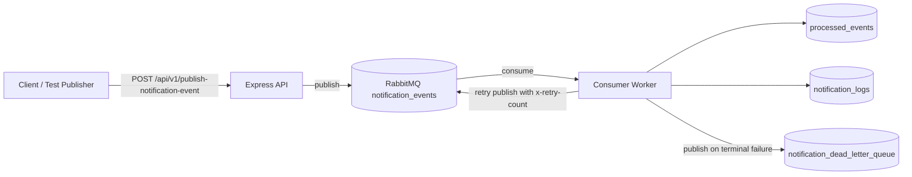
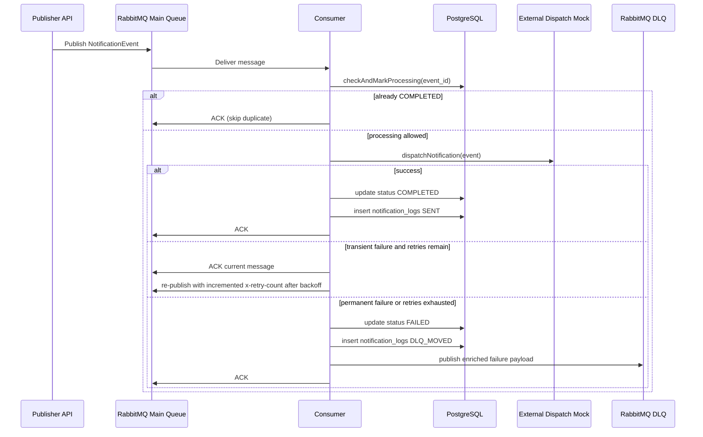

# ReliableRelay Architecture

## 1. System Goal
ReliableRelay is an event-driven notification backend designed to process NotificationEvent messages safely under at-least-once delivery constraints. The architecture prioritizes:

- exactly-once successful processing semantics per event_id
- resilience to transient downstream failures
- observable and debuggable failure handling
- operational simplicity in containerized environments

## 2. High-Level Architecture



## 3. Component Responsibilities

| Component | Responsibility | Key Files |
|---|---|---|
| HTTP API | Validate event payload, publish to MQ | src/api/index.ts |
| MQ Service | Connect to RabbitMQ, assert queues, consume messages, graceful drain | src/services/mq.ts |
| Consumer | Idempotency gate, dispatch, retries, DLQ movement | src/consumer/index.ts |
| Idempotency Service | Atomic check-and-mark and status transitions | src/services/idempotency.ts |
| Notification Service | Simulated external dispatch and dispatch audit logging | src/services/notification.ts |
| DB Layer | PostgreSQL pooling and query execution | src/db/index.ts |
| Runtime Entry | Health endpoints, startup wiring, graceful shutdown | server.ts |

## 4. Data Model

### processed_events
Tracks lifecycle state for each unique event_id.

- event_id (PK)
- status: PROCESSING | COMPLETED | FAILED
- created_at
- updated_at

### notification_logs
Audit records for dispatch outcomes.

- log_id (PK)
- event_id (FK -> processed_events.event_id)
- recipient
- type
- message_payload (JSONB)
- status: SENT | DLQ_MOVED
- processed_at

## 5. Message Contract

```json
{
  "event_id": "UUID",
  "type": "email | sms | push",
  "recipient": "string",
  "payload": { "any": "object" },
  "timestamp": "ISO-8601"
}
```

## 6. End-to-End Processing Flow



## 7. Idempotency Design

Idempotency uses a single atomic statement:

- INSERT new event_id with PROCESSING when absent
- ON CONFLICT do conditional update only when current status is not COMPLETED and not PROCESSING
- fallback SELECT to determine whether event is already COMPLETED or actively PROCESSING

This prevents duplicate successful side effects under concurrent deliveries.

## 8. Retry and Backoff Strategy

The consumer reads x-retry-count from message headers and applies exponential backoff:

- attempt 1 delay: 1000 ms
- attempt 2 delay: 5000 ms
- attempt 3 delay: 25000 ms

Formula:

$$
\text{delay}_n = \text{retryInitialDelay} \times 5^{(n-1)}
$$

When retry count reaches MAX_RETRIES, the message is finalized to DLQ.

## 9. Dead-Letter Strategy

Two DLQ paths are available:

- application-level terminal failures: publishToDLQ with context (originalEvent, error, retryCount, failedAt)
- broker-level dead-letter routing: reject malformed message without requeue (nack requeue=false)

This ensures poison messages do not block the main queue.

## 10. Graceful Shutdown

Shutdown sequence:

1. receive SIGINT or SIGTERM
2. cancel active RabbitMQ consumer to stop new deliveries
3. wait for in-flight handlers to finish (bounded timeout)
4. close MQ and DB connections
5. exit process

This reduces risk of message loss or duplicate effects during deploy/restart events.

## 11. Operational Health

Service exposes:

- GET /api/health
- GET /health

Health checks validate database connectivity and MQ channel availability. Docker Compose health checks gate service startup on dependent service readiness.

## 12. Scalability Considerations

- horizontal scaling: multiple consumer instances are supported by queue competing consumers
- strict ordering: currently not guaranteed globally; can be added with partitioning/sharding by recipient
- retry durability: currently re-publish scheduling is app-driven; can be evolved to delayed-exchange plugin or retry queues with TTL
- observability: structured JSON logs are ready for ELK/OpenSearch ingestion

## 13. Tradeoffs

| Choice | Benefit | Tradeoff |
|---|---|---|
| RabbitMQ classic queues | Simple setup and strong delivery semantics | Requires careful retry topology for durable delayed retries |
| PostgreSQL for idempotency and logs | Strong consistency and SQL auditability | Adds DB write path latency |
| Consumer-level retry scheduling | Easy to reason about | Delays are in-memory until republish is performed |
| Prefetch=1 | Limits concurrency hazards and simplifies exactly-once effects | Lower per-instance throughput |
