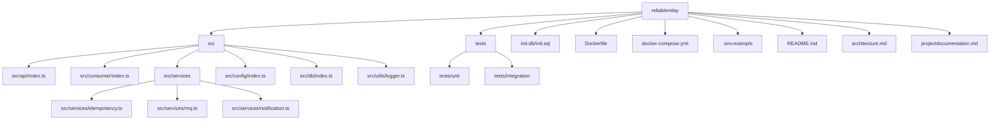
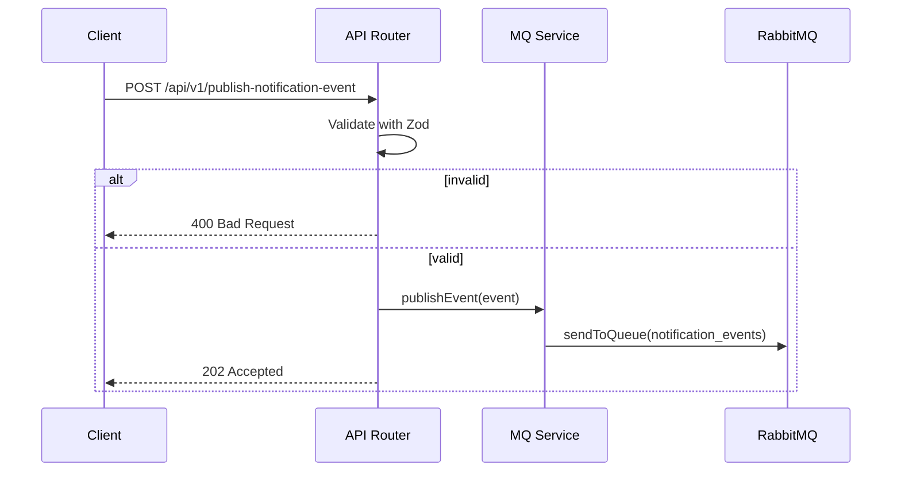
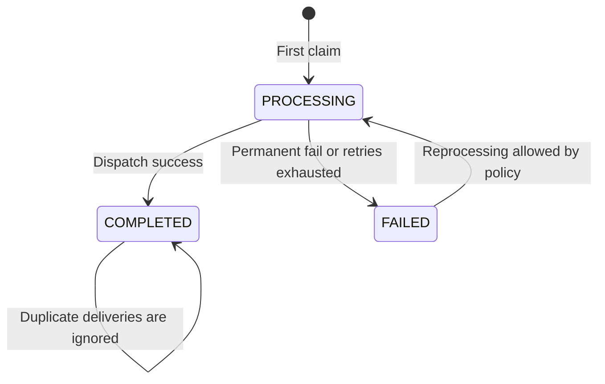

# ReliableRelay Project Documentation

## 1. Objective
Implement a robust event-driven notification service that:

- consumes notification events from a message queue
- guarantees idempotent processing by event_id
- retries transient failures with exponential backoff
- dead-letters terminally failing messages
- provides reliable operational visibility and health checks

## 2. Problem Statement
Distributed systems commonly deliver messages more than once. Without safeguards, duplicate deliveries can trigger duplicate user notifications and inconsistent business state. ReliableRelay solves this with persistent idempotency state, structured retry behavior, and DLQ isolation for poison messages.

## 3. Scope Delivered

- RabbitMQ-backed producer-consumer flow
- PostgreSQL schema for processing state and audit logs
- REST endpoint for publishing test events
- consumer pipeline with retry and DLQ semantics
- graceful shutdown logic for in-flight message safety
- unit and integration test suites
- Dockerized runtime with health checks and DB bootstrap

## 4. Technology Stack

| Layer | Technology | Why |
|---|---|---|
| API Layer | Express + TypeScript | Lightweight, typed, mature ecosystem |
| Messaging | RabbitMQ + amqplib | Reliable delivery, explicit ack/nack model |
| Persistence | PostgreSQL + pg | Strong consistency, JSON payload support |
| Validation | Zod | Runtime-safe schema enforcement |
| Logging | Winston | Structured JSON logs |
| Testing | Jest + Supertest | Fast unit/integration workflows |
| Runtime | Docker Compose | Repeatable local and CI execution |

## 5. Repository Layout

## 6. Runtime Workflow

### 6.1 Startup

1. app loads environment variables
2. DB pool is initialized
3. RabbitMQ connection/channel are created
4. main queue and DLQ are asserted
5. consumer starts with prefetch(1)
6. HTTP server starts and exposes API and health endpoints

### 6.2 Publish API Path

### 6.3 Consumer Path

1. consumer receives message
2. parse and schema-validate payload
3. malformed message is rejected to broker DLQ route
4. idempotency gate runs against processed_events
5. if duplicate completed event: ack and stop
6. dispatch notification via mock external call
7. on success: mark COMPLETED and insert SENT log
8. on transient error with attempts left: schedule backoff and republish with incremented header
9. on permanent error or max retries exhausted: mark FAILED, insert DLQ_MOVED log, publish terminal payload to DLQ

## 7. Idempotency Implementation Details

### 7.1 State Machine

### 7.2 Concurrency Safety

The check-and-claim operation uses an atomic insert/upsert strategy. This avoids non-atomic read-then-write races and gives a deterministic owner for each event_id processing window.

## 8. Retry Strategy

Retries are treated as transient-failure recovery, not as business-level replays.

- header used: x-retry-count
- max retries: MAX_RETRIES
- delay schedule: RETRY_INITIAL_DELAY * 5^retryCount

Example with default values:

- retry 1: 1 second
- retry 2: 5 seconds
- retry 3: 25 seconds

## 9. Dead-Letter Queue Semantics

DLQ receives:

- permanent failures (invalid recipient config, intentional permanent_fail test flag)
- exhausted transient failures
- malformed messages rejected without requeue

DLQ payload includes diagnostic context to support replay analysis and incident debugging.

## 10. Error Handling Model

| Condition | Classification | Action |
|---|---|---|
| malformed JSON | permanent | nack requeue=false -> broker DLQ |
| schema invalid payload | permanent | nack requeue=false -> broker DLQ |
| external random timeout/failure | transient | retry until MAX_RETRIES |
| explicit permanent_fail flag | permanent | fail immediately to DLQ |
| DB/MQ internal errors in DLQ publish path | terminal handling failure | nack requeue=false fallback |

## 11. Logging and Traceability

All major lifecycle events are logged in JSON:

- message received
- idempotency decisions
- dispatch attempts and outcomes
- retry scheduling with delay and attempt count
- DLQ movements
- startup/shutdown lifecycle

Correlation key used throughout logs: event_id.

## 12. Testing Strategy

### 12.1 Unit Tests

Validate pure behavior and service-level logic:

- schema validation
- idempotency service transitions
- consumer retry and DLQ branches
- notification service dispatch error typing and DB log writes

### 12.2 Integration Tests

Validate cross-module behavior:

- publisher endpoint request/response semantics
- end-to-end consumer flow with DB interactions mocked at repository boundary
- idempotency duplicate handling and terminal DLQ movement

## 13. Docker and Deployment Notes

docker-compose.yml provisions:

- postgres_db with schema bootstrap from init-db/init.sql
- rabbitmq with management UI and health checks
- notification_service with explicit dependency health gating

Health checks are configured for all three services to improve deterministic startup in local and CI.

## 14. Production Readiness Assessment

### Strengths

- strong idempotency foundation
- explicit retries with deterministic backoff
- clear DLQ path and audit trail
- graceful shutdown with in-flight drain
- structured logging suitable for aggregation

### Known Limits and Evolution Path

- delayed retry is app-scheduled; can be upgraded to durable delayed queues
- current integration tests mock transport boundaries; full containerized E2E tests can be added for CI parity
- throughput is intentionally conservative (prefetch 1); can be tuned with partition-safe processing policy

## 15. Runbook Commands

- start stack: docker-compose up --build
- service logs: docker-compose logs -f notification_service
- run tests: npm test
- run unit tests: npm run test:unit
- run integration tests: npm run test:integration

## 16. Conclusion
ReliableRelay satisfies the core hard requirements for a resilient event-driven notification backend: reliable MQ consumption, idempotent processing, controlled retries, DLQ capture, structured observability, and containerized operability. The architecture is intentionally practical and extensible for production-grade distributed systems.
